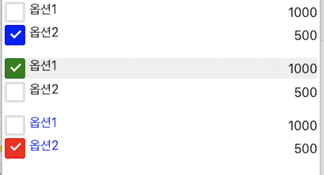

## react-radio-custom

#### Description

1. 장바구니 옵션용 라디오 버튼 그룹
2. 체크박스 및 같은 라인 클릭시 체크박스 선택되게끔
3. 박스 색깔 변경 가능
4. 텍스트 스타일 변경 가능

#### Usage

```js
const sampleData = [
  { group: "A", name: "옵션1", price: 1000 },
  { group: "A", name: "옵션2", price: 500 }
];

<Radio data={sampleData} textStyle={{ color: "blue" }} background="red" />;
```



#### Props

- textStyle: Object
- background: string
